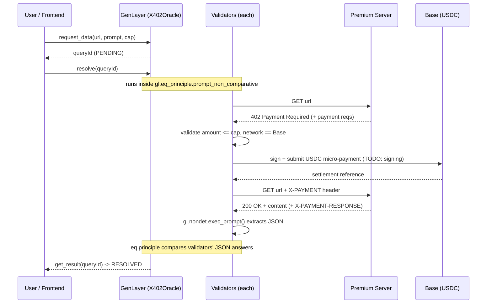

# x402 Paywalled-Data Oracle

An **Intelligent Oracle** on [GenLayer](https://genlayer.com) that reads
**premium / paywalled** data **without ever storing an API key on-chain**.

When the oracle needs data that sits behind a paywall, it pays **per request**
using the **[x402 protocol](https://github.com/coinbase/x402)** (HTTP `402
Payment Required`, Coinbase spec). The micro-payment settles on **Base** (an
EVM L2); the oracle's *state* settles on **GenLayer** via validator consensus.

---

## The problem

A blockchain is transparent by design. Every validator — and the entire public
— can read contract storage. That makes a public chain a **terrible vault for a
private API key**. GenLayer's own writing calls this out: Intelligent Oracles
can read the open web, but the moment the data lives behind a key-guarded
paywall, you can't just paste the key into the contract.

Workarounds are all bad:

- **Key in contract storage** → leaked to the world instantly.
- **Key held by one operator** → centralized, defeats the point of an oracle.
- **Key encrypted on-chain** → still has to be decrypted *somewhere* every
  validator can see.

## The idea: don't hold a key, pay per request

x402 reframes access from *"prove you own a subscription key"* to *"pay a few
cents for this one response."* The flow is HTTP-native:

1. The oracle requests a premium URL.
2. The server replies **`402 Payment Required`** with machine-readable payment
   instructions (pay-to address, asset, amount, network, nonce, expiry).
3. The oracle signs a **stablecoin micro-payment** (USDC on Base) and retries
   with an `X-PAYMENT` header.
4. The server verifies + settles the payment and returns **`200` + content**.
5. The oracle runs an **LLM extraction** on the content.
6. **Validators reach consensus** on the extracted answer via an equivalence
   principle, and the result is written to GenLayer state.

No standing subscription. No shared secret. Just pay-as-you-go data, with the
spend ceiling enforced per query.

---

## Architecture at a glance

```
        ┌──────────────┐  request_data(url, prompt, cap)   ┌──────────────────┐
        │   Frontend   │ ─────────────────────────────────▶│  GenLayer chain  │
        │ (genlayer-js)│  resolve(queryId)                  │  X402Oracle.py   │
        └──────────────┘ ◀──────────── get_result ──────────└──────────────────┘
                                                                     │
                                  per-validator, inside              │ gl.eq_principle
                                  the equivalence principle          ▼
                                                          ┌────────────────────────┐
                                                          │ gl.nondet.web.render()  │
                                                          │   GET premium url       │
                                                          └───────────┬─────────────┘
                                                                      │ 402 + reqs
                                                                      ▼
                                                          ┌────────────────────────┐
                                                          │ sign micro-payment      │
                                                          │ (USDC) ── settle ──▶ Base│
                                                          └───────────┬─────────────┘
                                                                      │ X-PAYMENT
                                                                      ▼
                                                          ┌────────────────────────┐
                                                          │ render() again → 200    │
                                                          │ gl.nondet.exec_prompt() │
                                                          │   LLM extracts JSON     │
                                                          └────────────────────────┘
```

**Two chains, two jobs:**

- **Base (EVM L2)** = the *payment rail*. Cheap, fast stablecoin settlement for
  the x402 micro-payment.
- **GenLayer** = the *settlement + consensus layer* for the oracle's answer.
  Validators independently run the non-deterministic work and agree on the
  result.

---

## x402 flow (sequence)



---

## Equivalence principle choice & rationale

GenLayer offers several equivalence principles for reconciling the
non-deterministic outputs different validators produce. The choice matters:

| Principle | When it fits | Why it does/doesn't fit here |
|---|---|---|
| Comparative / strict equality | deterministic or byte-identical outputs | Paywalled responses differ per validator (timestamps, whitespace, key order). LLM extraction varies token-by-token. Strict equality would never pass. |
| `eq_principle` with tolerance | numeric outputs within a band | Good for a single number, but our answers are structured JSON (mixed numeric + string fields). Tolerance alone can't judge string/enum fields. |
| `prompt_non_comparative` (chosen) | semantic agreement judged by an LLM | An LLM judges whether two validators' extracted JSON answers are semantically equivalent under explicit criteria. |

**We use `gl.eq_principle.prompt_non_comparative`.** The contract supplies a
`task` ("decide if the two extracted answers are equivalent") and `criteria`:

- numeric fields must match within **0.5%**,
- string/enum fields must match exactly (case-insensitive),
- timestamps, key ordering, and whitespace are ignored,
- the **paid amount must not exceed the agreed ceiling**.

This tolerates the irreducible noise of (a) fetching live paywalled data and
(b) LLM extraction, while still rejecting genuinely divergent answers. If you
narrow a query to a single numeric field, swapping to a tolerance principle
(`eq_principle` with a 0.5% band) is cheaper and is a reasonable alternative.

---

## Trust model in one line

The contract only ever pays whitelisted domains, never pays above the
per-query ceiling, and the payment key never lives in contract storage
(see `ARCHITECTURE.md` for the threat model and signing strategies).

---

## Repository layout

```
.
|-- README.md                 # this file
|-- ARCHITECTURE.md           # components, sequence, threat model, Base<->GenLayer
|-- .gitignore                # node + python
|-- contracts/
|   `-- x402_oracle.py         # GenLayer Intelligent Contract (skeleton)
`-- frontend/
    |-- package.json           # genlayer-js client deps (stub, not installed)
    |-- tsconfig.json
    `-- src/
        `-- client.ts          # connect -> submit -> resolve -> read
```

---

## Limitations

- **Payment signing is stubbed.** `_sign_x402_payment()` raises
  `NotImplementedError`. Wiring real, key-safe signing is the core open problem
  (see roadmap). Everything else is illustrative.
- **Representative GenLayer API.** Calls like `gl.nondet.web.render(...,
  headers=...)`, `gl.eq_principle.prompt_non_comparative(...)`, and storage
  decorators follow public conventions circa 2025 but are marked
  `# ASSUMPTION:` where not guaranteed. Verify against the SDK version you
  deploy with.
- **Cost / determinism of paying inside consensus.** If every validator pays,
  you multiply the micro-payment by the validator count and risk double-spend
  unless payments are idempotent (bound to the query's nonce). See the
  threat-model notes on a single-payer / co-processor design.
- **Server honesty.** A malicious 402 server can lie about price or content;
  the whitelist + ceiling + consensus mitigate but don't fully eliminate this.
- **Not audited, not deployed.** This is a scaffold/spec.

---

## Roadmap

1. **Key-safe signing** - implement `_sign_x402_payment` via one of: validator
   threshold signatures, a Base account-abstraction session key with an on-chain
   spend cap, or a trusted co-processor returning only the signed blob.
2. **Idempotent / single-payer settlement** - bind each payment to the query
   nonce so re-execution across validators can't double-pay or replay.
3. **Receipt verification** - verify the `X-PAYMENT-RESPONSE` settlement proof
   against Base before accepting content.
4. **Pluggable equivalence** - let the requester pick tolerance vs.
   non-comparative per query type.
5. **Refunds & disputes** - handle 402 servers that take payment but don't
   deliver.
6. **Frontend** - real wallet connection, event-driven `queryId` discovery,
   result rendering.

---

## Disclaimer

Illustrative scaffold for design discussion. Not production code, not audited,
no key-safe payment path implemented yet. Do not deploy as-is.
