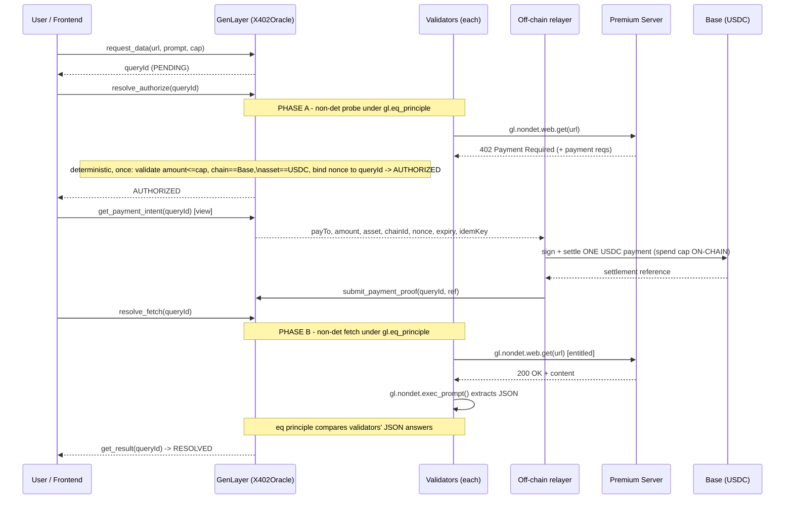

# x402 Paywalled-Data Oracle

An **Intelligent Oracle** on [GenLayer](https://genlayer.com) that reads
**premium / paywalled** data **without ever storing an API key on-chain**.

When the oracle needs data that sits behind a paywall, it pays **per request**
using the **[x402 protocol](https://github.com/coinbase/x402)** (HTTP `402
Payment Required`, Coinbase spec). The micro-payment settles on **Base** (an
EVM L2); the oracle's *state* settles on **GenLayer** via validator consensus.

---

## The problem

A blockchain is transparent by design. Every validator — and the entire public
— can read contract storage. That makes a public chain a **terrible vault for a
private API key**. GenLayer's own writing calls this out: Intelligent Oracles
can read the open web, but the moment the data lives behind a key-guarded
paywall, you can't just paste the key into the contract.

Workarounds are all bad:

- **Key in contract storage** → leaked to the world instantly.
- **Key held by one operator** → centralized, defeats the point of an oracle.
- **Key encrypted on-chain** → still has to be decrypted *somewhere* every
  validator can see.

## The idea: don't hold a key, pay per request

x402 reframes access from *"prove you own a subscription key"* to *"pay a few
cents for this one response."* The flow is HTTP-native, but settling a payment
from inside validator consensus needs care (see below). The contract splits
resolution into two phases so the money moves **exactly once**:

1. **Authorize** (`resolve_authorize`): the GenVM probes the premium URL. If the
   server replies **`402 Payment Required`** with machine-readable instructions
   (pay-to, asset, amount, network, nonce, expiry), validators reach consensus
   on those requirements and the contract **binds + validates** them once
   (amount <= ceiling, chain == Base, asset == USDC, nonce bound to the
   queryId). The query moves to **AUTHORIZED**. No money moves here.
2. **Settle** (off-chain relayer): a relayer reads the query-bound payment
   intent, signs **one** USDC micro-payment on Base using a **spend-capped AA
   session key** (the cap + payTo allowlist are enforced **on-chain on Base**),
   then calls `submit_payment_proof(queryId, ref)`. The key never touches
   GenLayer.
3. **Fetch** (`resolve_fetch`): once a proof is recorded, the GenVM fetches the
   now-entitled `200` content, runs an **LLM extraction**, and **validators
   reach consensus on the extracted answer** (never on the signature). The
   result is written to GenLayer state (**RESOLVED**).

No standing subscription. No shared secret. The spend ceiling is enforced both
in-contract (per query) and on-chain on Base (the authoritative backstop).

---

## Architecture at a glance

```
  Frontend (genlayer-js)                         GenLayer chain (X402Oracle.py)
      |  request_data(url, prompt, cap)                 |
      |------------------------------------------------>|  PENDING
      |  resolve_authorize(queryId)                     |
      |------------------------------------------------>|  PHASE A (non-det):
      |                                                 |   gl.nondet.web.get(url)
      |                                                 |   -> 402 -> consensus on reqs
      |                                                 |   bind+validate once -> AUTHORIZED
      |  get_payment_intent(queryId) [view]             |
      |<------------------------------------------------|
      v
  OFF-CHAIN relayer (holds Base AA session key)
      |  sign ONE USDC micro-payment (spend cap enforced ON-CHAIN on Base)
      |-----------------------------------------------> Base (USDC settle)
      |  submit_payment_proof(queryId, ref)             |
      |------------------------------------------------>|  proof recorded
      |  resolve_fetch(queryId)                         |  PHASE B (non-det):
      |------------------------------------------------>|   gl.nondet.web.get(url) -> 200
      |                                                 |   gl.nondet.exec_prompt -> JSON
      |                                                 |   eq_principle consensus -> RESOLVED
      |  get_result(queryId) [view]                     |
      |<------------------------------------------------|
```

**The payment never happens inside the per-validator consensus block.** The
GenVM only produces VALUES there (the parsed 402, the extracted JSON); the
single money-moving step is the off-chain relayer settling once, gated by the
on-chain spend cap. That is what avoids the "every validator pays N times"
hazard.

**Two chains, two jobs:**

- **Base (EVM L2)** = the *payment rail*. Cheap, fast stablecoin settlement for
  the x402 micro-payment.
- **GenLayer** = the *settlement + consensus layer* for the oracle's answer.
  Validators independently run the non-deterministic work and agree on the
  result.

---

## x402 flow (sequence)



---

## Equivalence principle choice & rationale

GenLayer offers several equivalence principles for reconciling the
non-deterministic outputs different validators produce. The choice matters:

| Principle | When it fits | Why it does/doesn't fit here |
|---|---|---|
| Comparative / strict equality | deterministic or byte-identical outputs | Paywalled responses differ per validator (timestamps, whitespace, key order). LLM extraction varies token-by-token. Strict equality would never pass. |
| `eq_principle` with tolerance | numeric outputs within a band | Good for a single number, but our answers are structured JSON (mixed numeric + string fields). Tolerance alone can't judge string/enum fields. |
| `prompt_non_comparative` (chosen) | semantic agreement judged by an LLM | An LLM judges whether two validators' extracted JSON answers are semantically equivalent under explicit criteria. |

**We use `gl.eq_principle.prompt_non_comparative`.** The contract supplies a
`task` ("decide if the two extracted answers are equivalent") and `criteria`:

- numeric fields must match within **0.5%**,
- string/enum fields must match exactly (case-insensitive),
- timestamps, key ordering, and whitespace are ignored,
- the **paid amount must not exceed the agreed ceiling**.

This tolerates the irreducible noise of (a) fetching live paywalled data and
(b) LLM extraction, while still rejecting genuinely divergent answers. If you
narrow a query to a single numeric field, swapping to a tolerance principle
(`eq_principle` with a 0.5% band) is cheaper and is a reasonable alternative.

---

## Trust model in one line

The contract only ever pays whitelisted domains, never pays above the
per-query ceiling, and the payment key never lives in contract storage
(see `ARCHITECTURE.md` for the threat model and signing strategies).

---

## Repository layout

```
.
|-- README.md                 # this file
|-- ARCHITECTURE.md           # components, sequence, threat model, Base<->GenLayer
|-- .gitignore                # node + python
|-- contracts/
|   `-- x402_oracle.py         # GenLayer Intelligent Contract (skeleton)
`-- frontend/
    |-- package.json           # genlayer-js client deps (stub, not installed)
    |-- tsconfig.json
    `-- src/
        `-- client.ts          # connect -> submit -> authorize -> fetch -> read
```

---

## Limitations

- **Real X-PAYMENT signing lives off-chain by design.** GenVM has no primitive
  to hold a secp256k1 key or sign an arbitrary payload, and value-moving side
  effects must happen once post-consensus (not per validator). So the signing
  is an explicit **relayer interface boundary**: the contract binds + validates
  the payment and exposes it via `get_payment_intent`; the relayer signs one
  Base AA-session-key payment (spend cap enforced on-chain) and reports it via
  `submit_payment_proof`. The relayer itself is not included in this repo.
- **Representative GenLayer API.** Calls like `gl.nondet.web.get(...)`,
  `gl.eq_principle.prompt_non_comparative(...)`, and storage decorators follow
  the verified SDK surface for GenVM v0.2.16 but a few kwargs (e.g. a `headers`
  arg on `web.get`) are marked `# ASSUMPTION:` where not guaranteed. Verify
  against the SDK version you deploy with.
- **Server honesty.** A malicious 402 server can lie about price or content;
  the whitelist + ceiling + consensus mitigate but don't fully eliminate this.
- **Not audited.** Deterministic + two-phase paths are unit-tested and the
  contract compiles/deploys (see `DEPLOYMENTS.md`), but the contract is
  unaudited and a live paid `resolve_fetch()` against a real paywall has not
  been exercised end-to-end (no real funds spent).

---

## Roadmap

1. **Production relayer** - ship the off-chain relayer that reads
   `get_payment_intent`, signs the Base AA-session-key payment, and calls
   `submit_payment_proof`. The contract side (binding, validation, exactly-once
   state machine) is implemented; the relayer service is the remaining piece.
2. **Receipt verification** - have `resolve_fetch` (or a guard before it) verify
   the `X-PAYMENT-RESPONSE` / settlement reference against Base before accepting
   content, instead of trusting the relayer's recorded proof.
3. **Pluggable equivalence** - let the requester pick tolerance vs.
   non-comparative per query type.
4. **Refunds & disputes** - handle 402 servers that take payment but don't
   deliver.
5. **Frontend** - real wallet connection, event-driven `queryId` discovery,
   result rendering.

---

## Disclaimer

Illustrative scaffold for design discussion. Not production code, not audited,
no key-safe payment path implemented yet. Do not deploy as-is.
